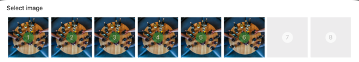

# React Native Image field
Image selector for React Native project. Select multiple images for your user forms, profile pictures,
from camera or gallery.

## Introduction

In order to use this library you need to install following libraries first - and consider; each might have
it's own linking with native code. **This is e2e module** which means it's only suitable if you want 
to use the specified underlying libraries. We do not fork, or install them individually.

* https://github.com/beefe/react-native-actionsheet#readme
* https://github.com/ivpusic/react-native-image-crop-picker

Both of these libraries need linking ( We do not use progressbar linking so it's safe )

## Usage

You can import this library simply after installing:

```
npm install react-native-image-field
```

and then:
```
import React from 'react';
import { View, SafeAreaView } from 'react-native';
import { ImageField } from './components/image-field/image-field.component';

async function uploader() {
  return 'https://images.unsplash.com/photo-1513618827672-0d7c5ad591b1?ixlib=rb-1.2.1&ixid=eyJhcHBfaWQiOjEyMDd9&auto=format&fit=crop&w=500&q=60';
}
export const App = () => (
  <SafeAreaView>
    <View>
      <ImageField
        images={[
          'https://images.unsplash.com/photo-1513618827672-0d7c5ad591b1?ixlib=rb-1.2.1&ixid=eyJhcHBfaWQiOjEyMDd9&auto=format&fit=crop&w=500&q=60',
          'https://images.unsplash.com/photo-1513618827672-0d7c5ad591b1?ixlib=rb-1.2.1&ixid=eyJhcHBfaWQiOjEyMDd9&auto=format&fit=crop&w=500&q=60',
          'https://images.unsplash.com/photo-1513618827672-0d7c5ad591b1?ixlib=rb-1.2.1&ixid=eyJhcHBfaWQiOjEyMDd9&auto=format&fit=crop&w=500&q=60',
          'https://images.unsplash.com/photo-1513618827672-0d7c5ad591b1?ixlib=rb-1.2.1&ixid=eyJhcHBfaWQiOjEyMDd9&auto=format&fit=crop&w=500&q=60',
          'https://images.unsplash.com/photo-1513618827672-0d7c5ad591b1?ixlib=rb-1.2.1&ixid=eyJhcHBfaWQiOjEyMDd9&auto=format&fit=crop&w=500&q=60',
          'https://images.unsplash.com/photo-1513618827672-0d7c5ad591b1?ixlib=rb-1.2.1&ixid=eyJhcHBfaWQiOjEyMDd9&auto=format&fit=crop&w=500&q=60'
        ]}
        // Async code that will upload an image, and return the public url
        uploadHandler={uploader}
        title="Select image"
      />
    </View>
  </SafeAreaView>
);
```

## Example


